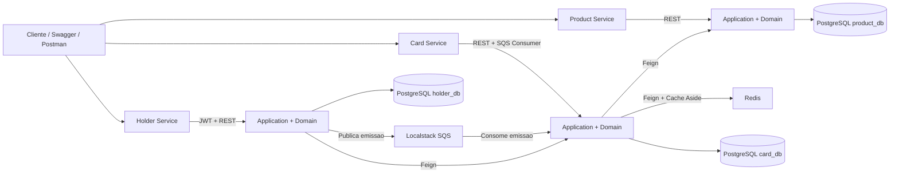

# Desafio Técnico Java Senior RPE

Desafio técnico para um ecossistema de emissão de cartões composto por três microserviços:

- `product-service`: catálogo de produtos de cartão
- `holder-service`: gestão de portadores e orquestração da emissão
- `card-service`: processamento de cartões, consumo de fila e cache de produto

O projeto foi construído com Java 17, Spring Boot 3, PostgreSQL, Redis, Localstack SQS, OpenAPI/Swagger e Docker.

## Visão Geral

O fluxo principal do sistema é:

1. Um produto é cadastrado no `product-service`.
2. Um portador é cadastrado no `holder-service`.
3. O `holder-service` publica uma solicitação de emissão no SQS.
4. O `card-service` consome a mensagem, valida o produto no `product-service`, utiliza cache Redis e cria o cartão.
5. O `holder-service` expõe um endpoint agregado com `Portador + Cartão + Produto`.

## Arquitetura



### Estrutura interna por serviço

Cada microserviço segue arquitetura hexagonal:

- `domain`: entidades, enums e exceções de negócio
- `application`: casos de uso e portas (`in` e `out`)
- `adapters.in`: controllers REST e listeners SQS
- `adapters.out`: persistência JPA, clients Feign, Redis e mensageria

Essa abordagem se adequa bem aqui porque o desafio possui múltiplas formas de entrada e saída:

- entrada HTTP
- entrada assíncrona via SQS
- saída para banco
- saída para Redis
- saída para outros microserviços via REST

Com a arquitetura hexagonal, a regra de negócio fica isolada dos detalhes de framework e infraestrutura, o que facilita evolução, testes, manutenção e troca de adapters sem espalhar acoplamento pelo código.

## Stack

- Java 17
- Spring Boot 3.3.x
- Spring Data JPA
- Spring Security + JWT
- Spring Cloud OpenFeign
- Spring Cloud AWS SQS
- PostgreSQL
- Redis
- Flyway
- MapStruct
- Springdoc OpenAPI / Swagger
- Docker e Docker Compose

## Instruções de Setup

### Pré-requisitos

- Java 17
- Maven 3.8+
- Docker
- Docker Compose

### 1. Clonar e acessar o projeto

```bash
git clone <url-do-repositorio>
cd card-processing-platform
```

### 2. Subir a infraestrutura de apoio

```bash
docker compose up -d postgres redis localstack
```

Isso sobe:

- PostgreSQL na porta `5432`
- Redis na porta `6379`
- Localstack na porta `4566`

### 3. Subir os serviços localmente

Em terminais separados:

```bash
mvn -pl product-service spring-boot:run
```

```bash
mvn -pl holder-service spring-boot:run
```

```bash
mvn -pl card-service spring-boot:run
```

### 4. Acessar o Swagger

- Product Service: [http://localhost:8081/swagger-ui.html](http://localhost:8081/swagger-ui.html)
- Holder Service: [http://localhost:8082/swagger-ui.html](http://localhost:8082/swagger-ui.html)
- Card Service: [http://localhost:8083/swagger-ui.html](http://localhost:8083/swagger-ui.html)

## Setup com Docker Compose

Para subir todo o ambiente com um unico comando:

```bash
docker compose up --build
```

Os Dockerfiles utilizam build multi-stage, entao o empacotamento Maven acontece dentro do proprio build da imagem. Isso significa que nao e necessario rodar `mvn clean package` antes para conseguir subir o ambiente completo.

O compose foi preparado para subir:

- PostgreSQL
- Redis
- Localstack
- `product-service`
- `holder-service`
- `card-service`

Se quiser rodar em background:

```bash
docker compose up --build -d
```

Para derrubar tudo depois:

```bash
docker compose down
```

## Fluxo de Teste Manual

### 1. Criar um produto

`POST /api/v1/products`

```json
{
  "name": "Black",
  "status": "ATIVO"
}
```

### 2. Gerar token no holder-service

`POST /api/v1/auth/token`

```json
{
  "username": "admin",
  "password": "admin123"
}
```

As credenciais em memória estão configuradas em `holder-service/src/main/resources/application.yml`.

### 3. Cadastrar um portador

`POST /api/v1/holders`

Header:

```text
Authorization: Bearer <token>
```

Body:

```json
{
  "name": "Lucas Silva",
  "cpf": "12345678901",
  "birthDate": "1990-05-10",
  "status": "ATIVO",
  "productId": "<uuid-do-produto>"
}
```

### 4. Consultar o cartão emitido

`GET /api/v1/cards/by-holder/{holderId}`

### 5. Consultar o agregado

`GET /api/v1/holders/{holderId}/full`

## Collection Postman

A collection para validacao manual do fluxo principal esta disponivel em [card-processing-platform.postman_collection.json](C:/Users/Lucas/OneDrive/Documentos/New%20project/postman/card-processing-platform.postman_collection.json).

Ela ja vem com variaveis de colecao para:

- `productBaseUrl`
- `holderBaseUrl`
- `cardBaseUrl`
- `username`
- `password`
- `accessToken`
- `productId`
- `holderId`

## Decisões Técnicas

### 1. Arquitetura hexagonal

A arquitetura hexagonal foi escolhida porque o desafio mistura:

- processamento síncrono e assíncrono
- integrações externas
- cache
- persistência
- autenticação

Nesse cenário, isolar o núcleo da aplicação dos detalhes técnicos evita que controller, banco, SQS e clients HTTP contaminem a regra de negócio. Isso reduz acoplamento e melhora testabilidade.

### 2. Comunicação entre serviços com Feign

Foi adotado OpenFeign nas comunicações REST entre microserviços porque:

- reduz boilerplate em comparação com `RestTemplate`
- deixa o contrato HTTP mais explícito
- facilita evolução futura com retry, interceptors e observabilidade
- melhora legibilidade do código

No projeto:

- `holder-service` consulta o `card-service` via Feign
- `card-service` consulta o `product-service` via Feign

### 3. Cache de produto com Redis

A estratégia escolhida foi **cache-aside** no `card-service`.

Fluxo:

1. O `card-service` tenta buscar o produto no Redis.
2. Se não encontrar, consulta o `product-service`.
3. Salva o produto no cache com TTL.
4. Usa o valor em memória/cache nas próximas consultas.

Essa estratégia foi escolhida porque:

- evita chamadas repetidas ao `product-service`
- reduz latência no fluxo de emissão e consulta
- diminui acoplamento temporal entre serviços
- é simples e previsível para um cenário de catálogo relativamente estável

### 4. Mensageria com SQS + DLQ

O `holder-service` não cria o cartão diretamente. Ele apenas publica a solicitação de emissão no SQS. O `card-service` consome de forma assíncrona.

Essa decisão melhora:

- desacoplamento entre cadastro de portador e emissão
- resiliência diante de indisponibilidade momentânea do processador de cartões
- escalabilidade do fluxo de emissão

Também foi configurada uma DLQ para suportar o cenário de falha repetida no consumo, o que é especialmente importante em contexto financeiro.

### 5. Flyway para versionamento de banco

Flyway foi utilizado para manter a criação e evolução de schema versionadas e reproduzíveis. Isso elimina dependência de criação manual de tabelas e torna o setup consistente entre ambientes.

### 6. MapStruct para mapeamentos

MapStruct foi escolhido para os mapeamentos entre domínio, persistência e responses porque:

- gera código em tempo de compilação
- tem melhor desempenho que abordagens reflexivas
- reduz verbosidade
- deixa o mapeamento explícito e rastreável

Isso é especialmente útil em um projeto com múltiplas fronteiras:

- entidade JPA ↔ domínio
- domínio ↔ response REST
- response de integração ↔ snapshot interno

## Como o sistema impede a criação de cartão para produto inexistente

Essa garantia acontece no `card-service`, que é o responsável final pela emissão.

Fluxo:

1. O `holder-service` recebe o cadastro do portador e publica a solicitação de emissão com o `productId`.
2. O `card-service` consome a mensagem.
3. Antes de criar o cartão, consulta o `product-service` para buscar o produto.
4. Se o produto não existir, o `product-service` retorna erro.
5. O `card-service` converte isso em falha de negócio e não persiste o cartão.
6. Como a mensagem continua falhando, ela pode seguir a política de reprocessamento e, após o limite, ir para a DLQ.

Além disso, o serviço também valida se o produto está com status `ATIVO`. Produtos inexistentes ou inativos não geram cartão.

Em outras palavras: o `holder-service` solicita a emissão, mas quem decide se o cartão pode ou não ser criado é o `card-service`, consultando a fonte oficial de catálogo.

## Resiliência Esperada

### Se o `product-service` estiver offline

- o `card-service` falha na validação do produto
- a mensagem não gera cartão incorreto
- após tentativas, pode seguir para a DLQ

### Se o SQS estiver indisponível

- o `holder-service` não consegue publicar a solicitação
- o cadastro do portador pode falhar no fluxo atual
- em produção, uma evolução natural seria adotar Outbox Pattern

### Se o produto estiver em cache

- o `card-service` reduz chamadas síncronas ao `product-service`
- o fluxo fica mais rápido e mais resiliente a oscilações pontuais

## Estrutura do Repositório

```text
.
├── product-service
├── holder-service
├── card-service
├── infra
│   ├── localstack
│   └── postgres
├── docker-compose.yml
└── pom.xml
```
